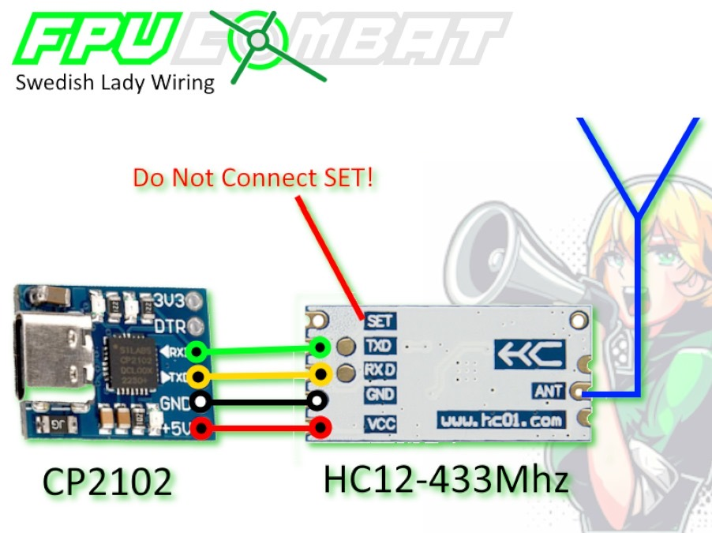

# Your friendly FPV Combat events announcer


## Wiring

For the application to work with the combat system, you need **HC-12 module** (e.g. Hailege HC-12 433Mhz SI4438 Wireless Transceiver) connected to PC via **USB to UART TTL converter** (e.g. CP2102 MICRO USB to UART TTL Convert Module).  
Optionally, install a separate 433mhz antenna to better reception.



## Usage
```
NAME:
   fpvc-lady - FPV Combat Events Announcer

USAGE:
   fpvc-lady [global options] command [command options]

VERSION:
   0.0.0

COMMANDS:
   help, h  Shows a list of commands or help for one command

GLOBAL OPTIONS:
   --port value    Port name where HC12 is connected to. (default: "auto") [$PORT]
   --speak value   Text-to-speech command: [system], google, none or any other command to convert text to speech. (default: "system") [$SPEAK]
   --speak-lives   Speak lives. (default: false) [$SPEAK_LIVES]
   --speak-cheers  Speak cheers. (default: false) [$SPEAK_CHEERS]
   --help, -h      show help
   --version, -v   print the version
```

When `--speak=google`, must have `mplayer` or `ffplay` installed.  

### Mac

Macs have male voice by default, use command below to switch to a female voice.
```
fpvc-lady-darwin-amd64-x.x.x --speak "say -v samantha"
```

### Windows

1. Copy fpvc-lady-windows-amd64-X.X.X.exe to a folder of your choice (in this example we will use "D:\FPV-Combat\lady")
2. Create a shortcut on your Desktop
   - Target: C:\Windows\System32\WindowsPowerShell\v1.0\powershell.exe -noexit "D:\FPV-COMBAT\lady\fpvc-lady-windows-amd64-0.3.0.exe --port COM10 "
   - Run In: "D:\FPV-COMBAT\lady\"
3. Modify the --port argument to your reality - check which Com-Port gets created when you plugin your CP2102
4. You are good to Go! - you can now start the lady by using the shortcut you just created - enable options as described above as you like it.


### Linux

Good luck!
